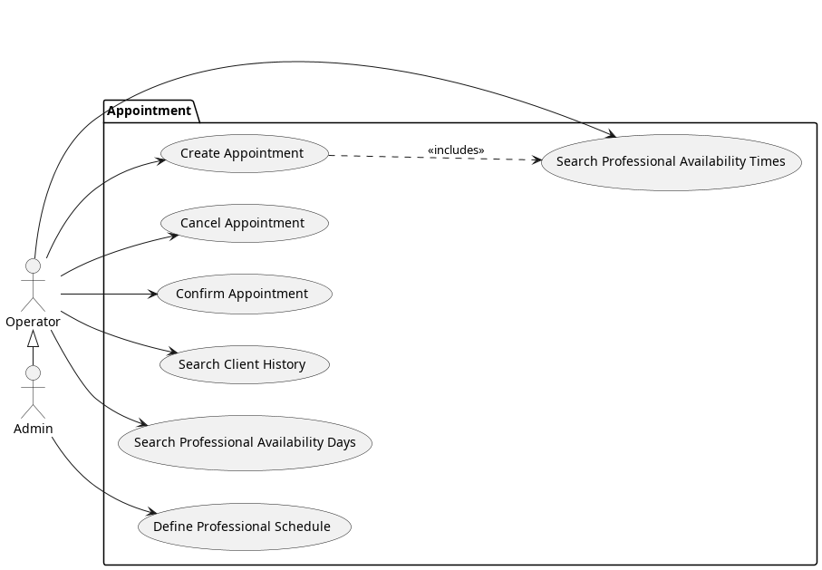
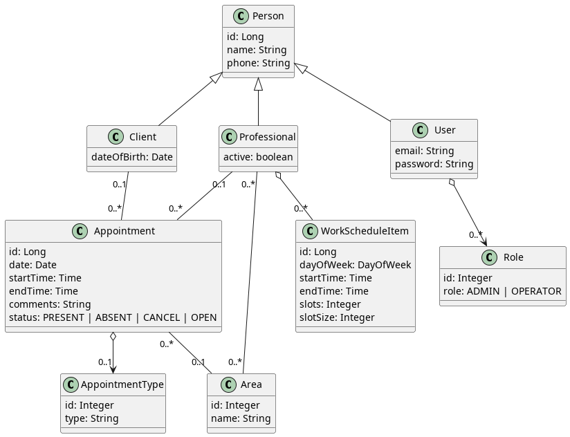

# Briefing — Appointment Scheduling System
    
    A clinic needs to manage the schedule of its professionals. All appointment scheduling is currently done by phone by the clinic’s attendants.
    In this first version, an MVP (Minimum Viable Product) will be implemented, focusing only on the essential needs for validation.
    Several other functionalities will be added in future versions once the MVP is approved by the client.
    The following items were gathered during the first meeting with the client:

## Basic Information:
    - The clinic’s working hours are from 8:00 AM to 12:00 PM and 2:00 PM to 6:00 PM (this may change in the future).
    - Each professional defines the days of the week and the time slots they will work, in 30-minute intervals between 8:00 AM–12:00 PM and 2:00 PM–6:00 PM, Monday to Friday (this may change in the future).
    - Each appointment must last 30 minutes, and the available scheduling times are in 30-minute intervals starting from 8:00 AM to 11:30 AM and from 2:00 PM to 5:30 PM, Monday to Friday (this may change in the future).
    - A professional can be active or inactive.
    - A professional may work in multiple areas, and the client must select both the area and the professional when scheduling.
    - An appointment has a type: either insurance or private.

## Making an Appointment:
    - The appointment must include: client, professional, area, type, comments, date, and start time (validate all information).
    - The system should display the available dates and time slots for a professional within a given month.
    - When scheduling an appointment, confirm the client’s phone number.

## Restrictions for Scheduling or Canceling Appointments:
    - Do not allow scheduling outside the clinic’s working hours or the professional’s availability.
    - Do not allow two or more clients to be scheduled for the same professional, date, and time.
    - Do not allow the same client to book multiple appointments at the same date and time.
    - Allow scheduling only with active professionals.
    - Do not allow scheduling in the past.
    - When scheduling, the area must be selected first, then the professional.
    - The attendant can cancel an appointment at the client’s request but cannot delete the scheduling history — the status should simply change to CANCELED.
    - There is no rescheduling feature — appointments can only be canceled.
    - When an appointment is canceled, the professional’s time slot must become available again.

## On the Day of the Appointment:
    - The system must track the attendance status of clients (PRESENT or ABSENT) on the appointment day.
    - List all appointments for the day, allowing filtering by area and professional. This screen must allow marking the client as present or absent.
    - The PRESENT status can only be updated on the day of the appointment.
    - The ABSENT status can only be updated after the appointment’s date and time.

## User Types:
    -  Operator User:
        - Can manage clients (CRUD).
        - Can schedule and cancel appointments.

    - Administrator: 
        - Has all operator permissions.
        - Can manage user accounts.
        - Can manage appointment types.
        - Can manage areas.
        - Can manage professionals.

## Maintenance (CRUDs):
    - Appointment Type Management (private, insurance 1, insurance 2). 
        Field: type.
    - Client Management. 
        Fields: name, phone, date of birth.
        Also allows listing the client’s appointment history.
    - Professional Management. 
        Fields: name, phone, active, and areas.
        When a professional is deactivated, keep their scheduled appointments active.
    - Area Management. 
        Field: name.
    - Professional Availability Management: 
        Fields: days and working hours.
        When a professional’s availability changes, keep their existing appointments active.
    - User Management. 
        Fields: name, email, password, phone, roles.

    Note: Do not delete records with active relationships (use logical deletion instead). 

## Responsiveness:
    - Must have a proper layout for screen widths 350px or greater.
    - Screen widths below 350px are not required to be supported.

## Diagrams
### Use Cases

### Model

